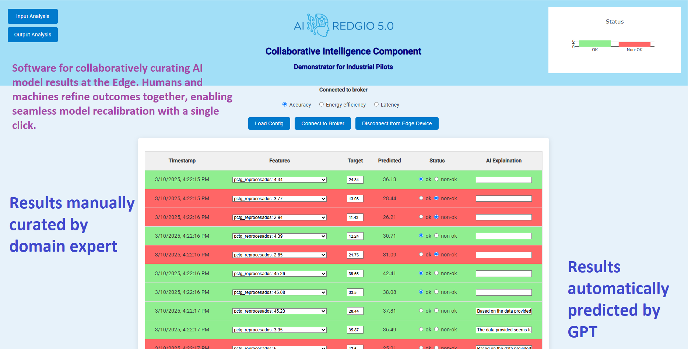

# Collaborative Intelligence Component (CI-Component)

[](https://doi.org/10.1007/978-3-032-05681-8_4)
[](https://doi.org/10.1007/978-3-032-05681-8_4)
[](https://arxiv.org/abs/2510.25813)
[](LICENSE)
[](#-scientific-contribution--capabilities)
<!-- After you archive a release on Zenodo (see "Archived Software DOI" below), replace the badge line under this comment with your real Zenodo DOI badge. -->
[](#-archived-software-doi-zenodo)

> **Official implementation of the Best Paper Award-winning framework at PRO-VE 2025.**

The **Collaborative Intelligence Component** is a web-based implementation of an **Agentic Framework for Industry 5.0**. It demonstrates a novel approach to **Human-in-the-Loop (HITL)** decision-making at the Edge, integrating Large Language Models (LLMs) to automate data curation and enable seamless, one-click model recalibration.

**Keywords:** Edge AI · Industry 5.0 · Human-AI Collaboration · Human-in-the-Loop · Agentic Frameworks · Collaborative Intelligence · Large Language Models · Explainable AI · MQTT · Smart Manufacturing


## 📄 Citation

If you use this code or framework in your research, **please cite the peer-reviewed paper**. GitHub also exposes a **"Cite this repository"** button (top-right of the repo page), powered by the included [`CITATION.cff`](CITATION.cff).

**Plain text:**

> Martinez-Gil, J., Pichler, M., Bountouni, N., Koussouris, S., Márquez Barreiro, M., & Gusmeroli, S. (2026). *An Agentic Framework for Rapid Deployment of Edge AI Solutions in Industry 5.0.* In L. M. Camarinha-Matos, A. Ortiz, X. Boucher, & A. Lucas Soares (Eds.), *Hybrid Human-AI Collaborative Networks (PRO-VE 2025)*, IFIP AICT vol. 771 (pp. 55–68). Springer, Cham. https://doi.org/10.1007/978-3-032-05681-8_4

**BibTeX (published version — please cite this one):**

```bibtex
@inproceedings{martinezgil2026agentic,
  author    = {Martinez-Gil, Jorge and Pichler, Mario and Bountouni, Nefeli and
               Koussouris, Sotiris and Barreiro, Marielena M{\'a}rquez and Gusmeroli, Sergio},
  title     = {An Agentic Framework for Rapid Deployment of Edge {AI} Solutions in Industry 5.0},
  booktitle = {Hybrid Human-AI Collaborative Networks (PRO-VE 2025)},
  editor    = {Camarinha-Matos, Luis M. and Ortiz, Angel and Boucher, Xavier and Lucas Soares, Antonio},
  series    = {IFIP Advances in Information and Communication Technology},
  volume    = {771},
  pages     = {55--68},
  year      = {2026},
  publisher = {Springer, Cham},
  doi       = {10.1007/978-3-032-05681-8_4},
  isbn      = {978-3-032-05681-8}
}
```

**BibTeX (open-access arXiv preprint):**

```bibtex
@article{martinezgil2025agentic_arxiv,
  author  = {Martinez-Gil, Jorge and Pichler, Mario and Bountouni, Nefeli and
             Koussouris, Sotiris and Barreiro, Marielena M{\'a}rquez and Gusmeroli, Sergio},
  title   = {An Agentic Framework for Rapid Deployment of Edge AI Solutions in Industry 5.0},
  journal = {arXiv preprint arXiv:2510.25813},
  year    = {2025},
  url     = {https://arxiv.org/abs/2510.25813}
}
```

**Read the paper:** [Springer (published)](https://doi.org/10.1007/978-3-032-05681-8_4) · [arXiv (open access)](https://arxiv.org/abs/2510.25813)

## 💾 Archived Software DOI (Zenodo)

To make the *software itself* independently citable, archive a tagged release on Zenodo:

1. Sign in at [zenodo.org](https://zenodo.org) with GitHub and enable this repository under **Settings → GitHub**.
2. On GitHub, create a release (e.g. `v1.0.0`). Zenodo automatically archives it and mints a DOI.
3. Copy the **concept DOI** (the version-independent one) and:
   - uncomment the `doi:` line in [`CITATION.cff`](CITATION.cff), and
   - replace the "archive pending" badge at the top of this README with the Zenodo-provided badge.

Once done, users can cite both the paper and a permanent snapshot of the exact code they used.

## 🎥 Video Demonstration

Watch the system in action, featuring real-time MQTT data processing and ChatGPT 4o integration:

[https://www.youtube.com/watch?v=AR8F8U-QXhM](https://www.youtube.com/watch?v=AR8F8U-QXhM)

## 🔬 Scientific Contribution & Capabilities

This repository implements the "Collaborative Intelligence" layer described in the associated paper. It bridges the gap between static Edge AI models and dynamic industrial environments through:



### 1. Human-Machine Collaboration (Industry 5.0)

Unlike traditional "black box" deployments, this tool provides a **Dynamic Validation Interface** where human experts can review, correct, and curate AI predictions in real-time.

### 2. Agentic Reasoning & XAI

The system integrates **Generative AI (ChatGPT 4o)** to act as an intelligent agent. It not only labels data but provides **Explainable AI (XAI)** reasoning for _why_ a prediction was flagged as "OK" or "Non-OK," reducing the cognitive load on human operators.

### 3. Rapid Edge Recalibration

The component features an automated feedback loop. Validated data (from humans or the GenAI agent) is used to **recalibrate the Edge AI model** with a single click, allowing the system to adapt to data drift without offline retraining cycles.

### 4. Synthetic Data Augmentation

To address the data scarcity common in industrial settings, the system leverages LLMs to generate additional training samples based on expert-curated positive and negative examples.

## ⚙️ System Architecture

The solution follows a modular architecture designed for Edge deployment:

-   **Frontend:** Lightweight HTML/CSS/JS interface for low-latency interaction.
-   **Communication Layer:** MQTT-based telemetry (compatible with HiveMQ, Mosquitto) for real-time sensor streams.
-   **Intelligence Layer:**
    -   _Edge Model:_ Handles immediate inference.
    -   _Cloud Agent:_ Connects to GenAI APIs (Chatbase/OpenAI) for higher-order reasoning.
-   **Visualization:** Plotly.js for dynamic, real-time performance monitoring.

## 🚀 Usage Guide

### Prerequisites

-   Modern Web Browser (Chrome, Firefox, Edge).
-   Access to an MQTT broker over WebSockets (e.g. the public HiveMQ broker used in the default config).

### Repository Layout

| File | Purpose |
| --- | --- |
| `app/client.html` | Main **Collaborative Intelligence** interface (monitor, validate, recalibrate). |
| `app/server.html` | Companion **data publisher** that streams sample readings to the broker to simulate an edge device. |
| `app/config.json` | MQTT broker URL, topics, and input/output feature mapping. |
| `data.csv` | Example industrial batch dataset. |

### Quick Start

1.  **Launch:** Open `app/client.html` in your browser.
2.  **(Optional) Simulate a device:** Open `app/server.html` in a second tab to publish sample telemetry to the broker.
3.  **Configure:** Adjust `app/config.json` (or load it from the interface) to point at your MQTT broker and define your input/output features.
4.  **Connect:** Connect to the broker to start the real-time MQTT stream.
5.  **Collaborate:**
    -   Monitor incoming predictions in the **Dynamic Table**.
    -   Use the **"GenAI"** action to auto-generate reasoning for anomalies.
    -   Manually correct targets if necessary.
6.  **Improve:** Click **"Recalibrate Model"** to update the edge model logic instantly.

### Configuration (`app/config.json`)

Define your MQTT topics and feature vectors:

```json
{
    "brokerURL": "wss://broker.hivemq.com:8884/mqtt",
    "inputTopic": "input",
    "outputTopic": "output",
    "inputs": [
        {"name": "Vibration_Sensor_X", "value": ""},
        {"name": "Temperature_C", "value": ""},
        {"name": "Pressure_PSI", "value": ""}
    ],
    "outputs": [
        {"name": "Target", "value": ""}
    ]
}
```

## 🛠 Customization

-   **Styling:** Fully customizable CSS for white-labeling.
-   **Model Backend:** The JavaScript logic is modular; `predict()` functions can be swapped for TensorFlow.js or ONNX runtimes.

## 🔗 Related Links

-   **Published paper (Springer):** https://doi.org/10.1007/978-3-032-05681-8_4
-   **Open-access preprint (arXiv):** https://arxiv.org/abs/2510.25813
-   **Project reference implementation:** https://github.com/AI-REDGIO-5-0/ci-component
-   **AI REDGIO 5.0 project:** https://www.airedgio5-0.eu

## 🤝 Acknowledgment

This work is supported by the **AI REDGIO 5.0** project: _"Regions and (E)DIHs alliance for AI-at-the-Edge adoption by European Industry 5.0 Manufacturing SMEs"_ under the European Union's **Horizon Europe** research and innovation programme, **Grant Agreement No. 101092069**.

## 📜 License

Released under the [MIT License](LICENSE). © 2023–2026 Jorge Martinez-Gil.
