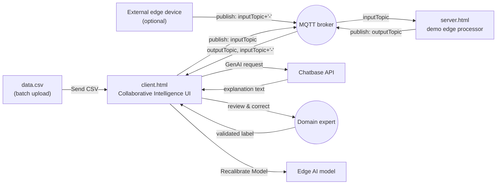

# Collaborative Intelligence Component (CI-Component)

[](https://doi.org/10.1007/978-3-032-05681-8_4)
[](https://doi.org/10.1007/978-3-032-05681-8_4)
[](https://arxiv.org/abs/2510.25813)
[](LICENSE)
[](#-scientific-contribution--capabilities)
[](#-implementation-notes--scope)


> **Official implementation of the Best Paper Award-winning framework at PRO-VE 2025.**

The **Collaborative Intelligence Component** is a web-based implementation of an **Agentic Framework for Industry 5.0**. It demonstrates a novel approach to **Human-in-the-Loop (HITL)** decision-making at the Edge, integrating Large Language Models (LLMs) to automate data curation and enable seamless, one-click model recalibration.

**Keywords:** Edge AI · Industry 5.0 · Human-AI Collaboration · Human-in-the-Loop · Agentic Frameworks · Collaborative Intelligence · Large Language Models · Explainable AI · MQTT · Smart Manufacturing


## 📋 Table of Contents

- [Citation](#-citation)
- [Archived Software DOI (Zenodo)](#-archived-software-doi-zenodo)
- [Video Demonstration](#-video-demonstration)
- [Scientific Contribution & Capabilities](#-scientific-contribution--capabilities)
- [System Architecture](#-system-architecture)
- [Usage Guide](#-usage-guide)
- [Customization](#-customization)
- [Implementation Notes & Scope](#-implementation-notes--scope)
- [Troubleshooting](#-troubleshooting)
- [Related Links](#-related-links)
- [Contributing](#-contributing)
- [Acknowledgment](#-acknowledgment)
- [License](#-license)

## 📄 Citation

If you use this code or framework in your research, **please cite the peer-reviewed paper**. GitHub also exposes a **"Cite this repository"** button (top-right of the repo page), powered by the included [`CITATION.cff`](CITATION.cff).

**Plain text:**

> Martinez-Gil, J., Pichler, M., Bountouni, N., Koussouris, S., Márquez Barreiro, M., & Gusmeroli, S. (2026). *An Agentic Framework for Rapid Deployment of Edge AI Solutions in Industry 5.0.* In L. M. Camarinha-Matos, A. Ortiz, X. Boucher, & A. Lucas Soares (Eds.), *Hybrid Human-AI Collaborative Networks (PRO-VE 2025)*, IFIP AICT vol. 771 (pp. 55–68). Springer, Cham. https://doi.org/10.1007/978-3-032-05681-8_4

**BibTeX (published version, please cite this one):**

```bibtex
@inproceedings{martinezgil2026agentic,
  author    = {Martinez-Gil, Jorge and Pichler, Mario and Bountouni, Nefeli and
               Koussouris, Sotiris and Barreiro, Marielena M{\'a}rquez and Gusmeroli, Sergio},
  title     = {An Agentic Framework for Rapid Deployment of Edge {AI} Solutions in Industry 5.0},
  booktitle = {Hybrid Human-AI Collaborative Networks (PRO-VE 2025)},
  editor    = {Camarinha-Matos, Luis M. and Ortiz, Angel and Boucher, Xavier and Lucas Soares, Antonio},
  series    = {IFIP Advances in Information and Communication Technology},
  volume    = {771},
  pages     = {55--68},
  year      = {2026},
  publisher = {Springer, Cham},
  doi       = {10.1007/978-3-032-05681-8_4},
  isbn      = {978-3-032-05681-8}
}
```

**Read the paper:** [Springer (published)](https://doi.org/10.1007/978-3-032-05681-8_4) · [arXiv (open access)](https://arxiv.org/abs/2510.25813)

## 🎥 Video Demonstration

Watch the system in action, featuring real-time MQTT data processing and ChatGPT 4o integration:

[](https://www.youtube.com/watch?v=AR8F8U-QXhM)

https://www.youtube.com/watch?v=AR8F8U-QXhM

## 🔬 Scientific Contribution & Capabilities

This repository implements the "Collaborative Intelligence" layer described in the associated paper. It bridges the gap between static Edge AI models and dynamic industrial environments through:


### 1. Human-Machine Collaboration (Industry 5.0)

Traditional "black box" deployments give operators no way to review an automated call before it reaches the line. This tool instead provides a **Dynamic Validation Interface** where human experts can review, correct, and curate AI predictions in real time.

### 2. Agentic Reasoning & XAI

The system integrates **Generative AI (ChatGPT 4o)** to act as an intelligent agent. It not only labels data but provides **Explainable AI (XAI)** reasoning for _why_ a prediction was flagged as "OK" or "Non-OK," reducing the cognitive load on human operators.

### 3. Rapid Edge Recalibration

The component features a feedback loop by design: validated data (from humans or the GenAI agent) is meant to **recalibrate the Edge AI model** with a single click, letting the system adapt to data drift without offline retraining cycles. In this reference build the click is wired to a placeholder confirmation; see [Implementation Notes & Scope](#-implementation-notes--scope) for what that means in practice.

### 4. Synthetic Data Augmentation

To address the data scarcity common in industrial settings, the system leverages LLMs to generate additional training samples based on expert-curated positive and negative examples.

## ⚙️ System Architecture

The solution follows a modular architecture designed for Edge deployment:

-   **Frontend:** Lightweight HTML/CSS/JS interface for low-latency interaction.
-   **Communication Layer:** MQTT-based telemetry (compatible with HiveMQ, Mosquitto) for real-time sensor streams.
-   **Intelligence Layer:**
    -   _Edge Model:_ Handles immediate inference.
    -   _Cloud Agent:_ Connects to GenAI APIs (Chatbase/OpenAI) for higher-order reasoning.
-   **Visualization:** Plotly.js for dynamic, real-time performance monitoring.

**Message flow in the demo:** a batch of readings goes out over MQTT, comes back as a prediction, and a human or the GenAI agent can validate it before an optional recalibration step.


```mermaid
flowchart LR
    CSV["data.csv<br/>(batch upload)"] -->|Send CSV| Client
    Edge["External edge device<br/>(optional)"] -->|publish: inputTopic+'-'| Broker(("MQTT broker"))
    Client["client.html<br/>Collaborative Intelligence UI"] -->|publish: inputTopic| Broker
    Broker -->|inputTopic| Server["server.html<br/>demo edge processor"]
    Server -->|publish: outputTopic| Broker
    Broker -->|outputTopic, inputTopic+'-'| Client
    Client -->|GenAI request| AI["Chatbase API"]
    AI -->|explanation text| Client
    Client -->|review & correct| Expert(("Domain expert"))
    Expert -->|validated label| Client
    Client -->|Recalibrate Model| Model["Edge AI model"]
```

## 🚀 Usage Guide

### Prerequisites

-   Modern Web Browser (Chrome, Firefox, Edge).
-   Access to an MQTT broker over WebSockets (e.g. the public HiveMQ broker used in the default config).
-   Outbound internet access: `client.html` and `server.html` load MQTT.js, Plotly.js, and Google Fonts from a CDN, so both files need a network connection even when opened locally.

### Repository Layout

| File | Purpose |
| --- | --- |
| `app/client.html` | Main **Collaborative Intelligence** interface (monitor, validate, recalibrate). |
| `app/server.html` | Companion **data publisher** that streams sample readings to the broker to simulate an edge device. |
| `app/config.json` | MQTT broker URL, topics, and input/output feature mapping. |
| `data.csv` | Example industrial batch dataset. |

The repository root also carries citation and archival metadata (`CITATION.cff`, `codemeta.json`, `LICENSE`) and the award image (`best-paper.jpg`). `app/data.csv` and `app/data.csv0` are additional local CSV samples used during development; they are not required to run the demo. `logo.png` is duplicated at the root for project listings and previews, while the running app loads `app/logo.png`.

### Quick Start

1.  **Launch:** Open `app/client.html` in your browser.
2.  **(Optional) Simulate a device:** Open `app/server.html` in a second tab to publish sample telemetry to the broker.
3.  **Configure:** Adjust `app/config.json` (or load it from the interface) to point at your MQTT broker and define your input/output features.
4.  **Connect:** Connect to the broker to start the real-time MQTT stream.
5.  **Collaborate:**
    -   Monitor incoming predictions in the **Dynamic Table**.
    -   Use the **"GenAI"** action to auto-generate reasoning for anomalies.
    -   Manually correct targets if necessary.
6.  **Improve:** Click **"Recalibrate Model"** to trigger the recalibration hook (see [Implementation Notes & Scope](#-implementation-notes--scope)).

### Configuration (`app/config.json`)

Define your MQTT topics and feature vectors:

```json
{
    "brokerURL": "wss://broker.hivemq.com:8884/mqtt",
    "inputTopic": "input",
    "outputTopic": "output",
    "inputs": [
        {"name": "Vibration_Sensor_X", "value": ""},
        {"name": "Temperature_C", "value": ""},
        {"name": "Pressure_PSI", "value": ""}
    ],
    "outputs": [
        {"name": "Target", "value": ""}
    ]
}
```

## 🛠 Customization

-   **Styling:** Fully customizable CSS for white-labeling.
-   **Model Backend:** The JavaScript logic is modular; `predict()` functions can be swapped for TensorFlow.js or ONNX runtimes.

## 🧪 Implementation Notes & Scope

This repository is the reference implementation that accompanies the PRO-VE 2025 paper. A few things are worth knowing before pointing it at a real production line:

-   **Recalibration is a hook, not a trainer.** The **Recalibrate Model** button in `app/client.html` currently shows a confirmation message. It marks where a retraining or redeployment call belongs, so it can be wired to a real pipeline.
-   **GenAI needs its own credentials.** The **GenAI** button calls the Chatbase REST API through `sendMessageToChatabase()`. The `apiKey` and `chatbotId` shipped in the file are placeholders, so replace them with real values before the button returns real explanations.
-   **The default broker is public.** `app/config.json` points at the public `broker.hivemq.com` instance so the demo works with no setup. That broker is unauthenticated and visible to anyone subscribed to the same topics, so swap in a private, authenticated broker before sending real sensor or product data.
-   **One link is machine-specific.** The "Input Analysis" button in `app/client.html` opens `http://localhost:8501/?file_url=C:/Users/martinez/Documents/GitHub/ci-component/data.csv`, a local path used during development. Point it at your own analysis tool, or remove it, before sharing a deployed copy.

## 🩺 Troubleshooting

-   **"Connect to Broker" stays disabled.** The button only activates after a valid `config.json` is loaded through **Load Config**; on success, the app calls the broker connection automatically.
-   **Status never leaves "Not connected to broker."** Check the browser console for a WebSocket error. Public brokers like HiveMQ can refuse connections under load; retry, or point `brokerURL` at a broker under your own control.
-   **GenAI returns "Error fetching AI response."** This is expected until real Chatbase credentials are set (see [Implementation Notes & Scope](#-implementation-notes--scope)).
-   **Recalibrate Model only shows an alert.** That is the current behavior of the reference build; see [Implementation Notes & Scope](#-implementation-notes--scope).
-   **The page loads with no charts and no MQTT activity.** `client.html` and `server.html` fetch their libraries from a CDN, so confirm the browser has an active internet connection even for a local file.

## 🔗 Related Links

-   **Published paper (Springer):** https://doi.org/10.1007/978-3-032-05681-8_4
-   **Open-access preprint (arXiv):** https://arxiv.org/abs/2510.25813
-   **Project reference implementation:** https://github.com/AI-REDGIO-5-0/ci-component
-   **AI REDGIO 5.0 project:** https://www.airedgio5-0.eu

## 🧩 Contributing

Issues and pull requests are welcome, particularly around the recalibration hook, broker security defaults, and additional edge-model backends. Fork the repository, create a feature branch, and open a pull request that describes the change and how it was tested. For questions about the research behind the component, see [Citation](#-citation).

## 🤝 Acknowledgment

This work is supported by the **AI REDGIO 5.0** project: _"Regions and (E)DIHs alliance for AI-at-the-Edge adoption by European Industry 5.0 Manufacturing SMEs"_ under the European Union's **Horizon Europe** research and innovation programme, **Grant Agreement No. 101092069**.

## 📜 License

Released under the [MIT License](LICENSE). © 2023–2026 Jorge Martinez-Gil.
