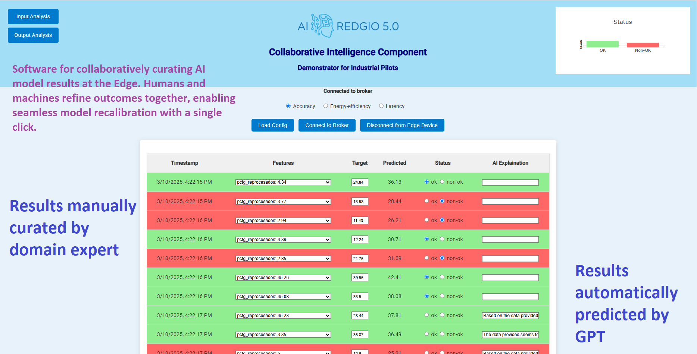

# Collaborative Intelligence Component

## Overview
This project consists of a web-based application designed to demonstrate a collaborative intelligence component. It's an industrial pilot that showcases the functionalities of data visualization and manipulation using HTML, CSS, and JavaScript.



## Features
- Display of data in a table format.
- Data loading from a CSV file.
- Dynamic interaction with data (e.g., filtering and status updating).
- Custom CSS styling for a pleasant user interface.
- Use of Google Fonts for typography.
- Interactive chart for data visualization.

## Structure
- **HTML**: The HTML file contains the basic structure of the web page, including headers, a table for displaying data, and a section for charts.
- **CSS**: The CSS within the `<style>` tag in the HTML head provides custom styling for the web page, including fonts, colors, and layout designs.
- **JavaScript**: The script at the end of the body handles data loading, parsing, and dynamic updating of the table and chart.

## Usage
1. **Viewing the Page**: Open the HTML file in a web browser to view the interface.
2. **Loading Data**: Click on the 'Load CSV' button to upload and display data from a CSV file.
3. **Interacting with Data**: Use radio buttons to change the score types and interact with the data in the table.
4. **Printing Non-OK Rows**: Click on 'Print Non-OK Rows to File' to save rows with a non-OK status to a file.

## Customization
- **Styling**: Modify the CSS in the `<style>` tag to customize the look and feel of the web page.
- **Data Handling**: Adjust the JavaScript functions to change how data is loaded, parsed, and displayed.

## Requirements
- A modern web browser.
- A CSV file for data upload.


## Citation
For academic use, please refer to our work:

```
@article{martinez2023examining,
  title={Examining the Adoption of Knowledge Graphs in the Manufacturing Industry: A Comprehensive Review},
  author={Martinez-Gil, Jorge and Hoch, Thomas and Pichler, Mario and Heinzl, Bernhard and Moser, Bernhard and Kurniawan, Kabul and Kiesling, Elmar and Krause, Franz},
  journal={Artificial Intelligence in Manufacturing: Enabling Intelligent, Flexible and Cost-Effective Production Through AI},
  pages={55--70},
  year={2023},
  publisher={Springer Nature Switzerland Cham}
}
```

## Acknowledgement
This work is performed in the context of the AI REDGIO 5.0 “Regions and (E)DIHs alliance for AI-at-the-Edge adoption by European Industry 5.0 Manufacturing SMEs” EU Innovation Action Project under Grant Agreement No 101092069
